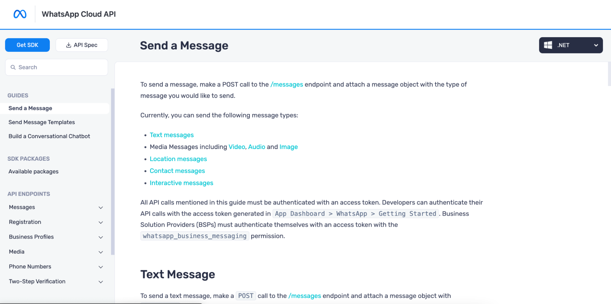

# How to Automate SDK and Documentation Generation for Your REST APIs

Developers and architects devote a significant amount of time to automate an application's lifecycle. They may use pipelines and workflows to build and test application code automatically, and in some cases the application code may be deployed directly into production.

However, once the dust has settled on the software lifecycle, someone must write the documentation and update the SDKs/libraries. These are frequently regarded as janitorial duties in software development, assigned to a junior developer or intern. Or even worse, a senior employee must dedicate valuable time to write a code sample for a documentation wiki.

This manual and mundane task can actually be fully automated by integrating documentation and SDK generation directly into existing CI/CD pipelines.

APIMatic is a developer experience platform that focuses on automating the API Consumption phase of your API lifecycle. The on-premises code generation solution can be directly deployed in your Openshift cluster, however, there is also a fully managed and hosted option that you can try for free at [https://www.apimatic.io](https://apimatic.io).

This tutorial will guide you to:

1. Setup the APIMatic CodeGen Operator in your Openshift Cluster
2. Generate SDKs and an API Portal for a sample REST API application
3. Deploy the Generated API Portal in the OpenShift cluster 
4. Setup CI/CD using Tekton and GitHub Actions to automate updates to the API Portal

   

# Prerequisites

Here is what you need to follow along with this demo:

1. An evaluation license from APIMatic. (Contact `sales@apimatic.io` for a trial license)
2. An Openshift Cluster
3. Oc and tkn CLIs

All of the files referred to in the tutorial are available in this [Git repository](https://github.com/apimatic/apimatic-codegen-openshift-pipelines-demo).

You can also replicate this workflow using your hosted APIMatic account as demonstrated in this [GitHub repository](https://github.com/apimatic/static-portal-workflow).

# Application Setup

The following section details setting up the APIMatic CodeGen Application in your Openshift Cluster. Before proceeding, clone the sample repository ([https://github.com/apimatic/apimatic-codegen-openshift-pipelines-demo](https://github.com/apimatic/apimatic-codegen-openshift-pipelines-demo)) and navigate to the root of your local copy.


## Install Operators

Install the APIMatic CodeGen Operator along with the Red Hat Openshift Pipelines Operator. The provided manifest file will help you do this. 

`oc apply -f setup/operatorsassets.yaml`

## Setup Project

Create a Project where the resources provisioned for this demo will reside. Store the Project name in a variable for use in subsequent commands.

`$OPENSHIFT_PROJECT=”pipelines-demo”`

`oc new-project $OPENSHIFT_PROJECT  --description='Project to configure pipelines demo in' --display-name='APIMatic CodeGen Pipelines Demo'`

## Instantiate APIMatic Codegen 

Create an instance of the APIMatic Codegen Application. You will need to Base64 encode your APIMatic evaluation license and substitute the placeholder in the *setup/codegen.yaml* file with it.  

`sed -i -e 's/LICENSE_PLACE_HOLDER/&lt;Your Apimatic License Blob>/' setup/codegen.yaml`

`oc apply -f setup/codegen.yaml -n $OPENSHIFT_PROJECT`

You should now have the CodeGen Application running in your Openshift cluster.


# SDK & API Portal Generation using APIMatic CodeGen

The APIMatic CodeGen application exposes a [REST API](https://apimatic-core-v3-docs.netlify.app/#/http/api-endpoints/client-generator/generate-using-file) that allows users to generate an API Portal consisting of reference documentation, code samples and SDKs in multiple programming languages. 

In order to generate this Portal, APIMatic CodeGen requires the following input files:

1. API Specification in any [supported format](https://docs.apimatic.io/api-transformer/overview-transformer/) including OpenAPI/Swagger, RAML and Insomnia to name a few.
2. A JSON configuration file that allows you to configure the API Portal.
3. [Optional] Custom documentation in Markdown format.

The `Portal directory` in the sample repository contains these input files. 

Refer to the [documentation](https://docs.apimatic.io/api/on-premises/#/http/generating-api-portal/overview-generating-api-portal/inputs-for-portal-generation) to learn more about them. 

These files are zipped together and passed to the APIMatic CodeGen application via a POST call to the `/build` endpoint. The subsequent steps of this tutorial will walk you through this process. 

# Automation

This section details setting up pipelines to automate API Portal generation and deployment using Tekton Pipelines and GitHub Actions.

## Setup Tekton Pipeline

The *.tekton directory* contains the pipeline required to generate and deploy an API Portal using APIMatic Codegen. This pipeline uses tasks sourced from the Tekton community hub as well as custom tasks. Each task represents a step in the API Portal generation process.

Following is a brief description of each pipeline task according to the order of execution.

### Fetch Repository

This task makes use of the `git-clone` task from the community hub to clone the sample GitHub repository which you have already cloned. The manifest files in this repository are used to setup the required infrastructure and generate a sample API Portal.  

### Zip Build Folder

This task creates a .zip file from the contents of the `Portal directory` provided in the sample GitHub repository. This .zip file is required by APIMatic CodeGen to generate an API Portal. 

```
.tekton/zip-build-folder-task.yaml
—----------------------------------------
apiVersion: tekton.dev/v1beta1
kind: Task
metadata:
  name: zip-build-folder
spec:
  workspaces:
  - name: buildfolder
  steps:
    - name: zip
      image: joshkeegan/zip:3.16.0
      workingDir: /workspace/buildfolder/Portal
      command: ["/bin/sh", "-c"]
      args:
        - |-
          echo Zipping the Portal directory
          zip -r $(workspaces.buildfolder.path)/apimatic.zip .
```

### Get Portal Zip

This task passes the .zip file created in the previous step to APIMatic CodeGen via an API call. The response from the API is another .zip file containing the generated API Portal. 

```
.tekton/get-portal-zip.yaml
—-----------------------------------------
apiVersion: tekton.dev/v1beta1
kind: Task
metadata:
  name: get-portal-zip
spec:
  workspaces:
  - name: portalzip
  params:
    - name: apimatic-codegen-service
      description: The OpenShift codegen service URL running on cluster
      type: string
  steps:
    - name: curl
      image: curlimages/curl:7.83.1
      workingDir: /workspace/portalzip
      command: ["/bin/sh", "-c"]
      args:
        - |-
          echo Obtaining portal.zip file from APIMatic Codegen app running in cluster
          curl -X POST --url $(inputs.params.apimatic-codegen-service):8080/api/build -F "file=@apimatic.zip" >> portal.zip
```

### Build API Portal Image

The API Portal generated by APIMatic Codegen is in effect a static website which can be served by any static web server. 

The buildah task from the Tekton hub is used to create and publish an image for a container capable of serving the generated API Portal.


### Apply Manifests

This task applies the manifest files contained in the k8s directory of the sample repository. These manifest files set up the Deployment, Service and Route which will enable you to access the API Portal outside the Openshift cluster. 

```
.tekton/apply-manifest-task.yaml
—------------------------------------------
apiVersion: tekton.dev/v1beta1
kind: Task
metadata:
  name: apply-manifests
spec:
  workspaces:
  - name: source
  steps:
    - name: apply
      image: image-registry.openshift-image-registry.svc:5000/openshift/cli:latest
      workingDir: /workspace/source
      command: ["/bin/bash", "-c"]
      args:
        - |-
          echo Applying manifests in k8s directory
          oc apply -f k8s
          echo -----------------------------------
```

### Update Deployment

This is the last task in the pipeline which is responsible for patching your deployment.

```
Update-deployment-task.yaml
—-----------------------------------------
apiVersion: tekton.dev/v1beta1
kind: Task
metadata:
  name: update-deployment
spec:
  params:
    - name: deployment
      description: The name of the deployment patch the image
      type: string
    - name: IMAGE
      description: Location of image to be patched with
      type: string
  steps:
    - name: patch
      image: image-registry.openshift-image-registry.svc:5000/openshift/cli:latest
      command: ["/bin/bash", "-c"]
      args:
        - |-
          oc patch deployment $(inputs.params.deployment) --patch='{"spec":{"template":{"spec":{
            "containers":[{
              "name": "$(inputs.params.deployment)",
              "image":"$(inputs.params.IMAGE)"
            }]
          }}}}'
```

## Apply Tekton Pipeline

1. Once you have updated the deployment, apply all Pipeline tasks using the following commands:

`oc apply -f .tekton/apply-manifest-task.yaml -n $OPENSHIFT_PROJECT`

`oc apply -f .tekton/update-deployment-task.yaml -n $OPENSHIFT_PROJECT`

`oc apply -f .tekton/get-portal-zip.yaml -n $OPENSHIFT_PROJECT`                                    

`oc apply -f .tekton/zip-build-folder-task.yaml -n $OPENSHIFT_PROJECT`

2. Next, apply the pipeline:

`oc apply -f .tekton/pipeline.yaml -n $OPENSHIFT_PROJECT`


3. With the pipeline applied, you are ready to execute it. You will need to pass in the following parameters in order to do so:

```
params:
    - description: name of the deployment to be patched
      name: deployment-name
      type: string
    - description: url of the git repo for the code of deployment
      name: git-url
      type: string
    - default: main
      description: revision to be used from repo of the code for deployment
      name: git-revision
      type: string
    - description: image to be build from the code
      name: IMAGE
      type: string
    - description: >-
        The OpenShift DNS url of the APIMatic CodeGen service running in the
        cluster
      name: apimatic-codegen-service
      type: string
```

4. Use the tkn Client to pass in these parameters and execute the Pipeline:

```
tkn pipeline start build-and-deploy \
          -w name=shared-workspace,volumeClaimTemplateFile=.tekton/persistent_volume_claim.yaml \
          -p deployment-name=apimatic-dx-portal-demo \
          -p git-url=https://github.com/apimatic/apimatic-codegen-openshift-pipelines-demo\ 
          -p IMAGE="image-registry.openshift-image-registry.svc:5000/$OPENSHIFT_PROJECT/apimatic-dx-portal-demo" \
          -p apimatic-codegen-service="apimatic-codegen.$OPENSHIFT_PROJECT.svc.cluster.local" \
          --use-param-defaults \
          --showlog=true \
          -n $OPENSHIFT_PROJECT
```


5. After successful completion of this pipeline, navigate to the **Networking** section in your Openshift Console to see the **Route** that exposes the generated API Portal.




## Components of the Generated API Portal

The generated API Portal contains all the core components required to provide a great Developer Experience to API Consumers. 

This includes:

1. **Getting Started guides:** Autogenerated guides that provide step-by-step instructions to help developers set up their environment and learn about essential things like Authentication and Response Codes.
2. **SDKs:** Autogenerated Client Libraries in multiple programming languages that significantly reduce the amount of integration code developers need to write. These SDKs are battle tested and guaranteed to work when nothing else does.
3. **Code Samples:** Code samples for integrating with each individual API endpoint. These code samples use the generated SDKs to make API calls and serve as starter code that can be used as-is without the need for any modification. This significantly reduces the *time to first API call* for the API.
4. **Try-it-out:** The Portal provides users the ability to call the API from within the API Portal.

# GitHub Actions


In the previous steps, you set up the APIMatic CodeGen application in your Openshift Cluster and used it to generate an API Portal via a Tekton pipeline. Although tekton is doing a lot of the heavy lifting, there are still some steps that need to be performed manually, such as the installation of the APIMatic CodeGen Operator and instantiation of the CodeGen application. 

These manual steps which deal with infrastructure setup and API Portal generation can also be automated with the help of GitHub Actions. 

## Automate Everything

Start by forking the [sample repository](https://github.com/apimatic/apimatic-codegen-openshift-pipelines-demo). This will enable you to run the provided GitHub workflows.

The oc and tkn CLIs are available for use in GitHub Actions via the [openshift-tools-installer Action](https://github.com/marketplace/actions/openshift-tools-installer) provided by Red Hat on the GitHub marketplace. This Action is used by the provided workflow to automate infrastructure setup. 

The **.github/workflows** directory contains a file called **setup_openshift_infrastructure.yaml**. This file defines a Github Action that automates all the steps that you have manually performed so far. 

In order to use this GitHub Action, you will be required to set up the following repository secrets in the GitHub repository:

- **OPENSHIFT_LOGIN_TOKEN:** token to use with the oc login command
- **OPENSHIFT_LOGIN_SERVER:** server URL to use with the oc login command
- **OPENSHIFT_PROJECT:** Openshift Project name
- **APIMATICLICENSEBLOB:** Base64 encoded string generated from the APIMatic evaluation license  

With these repository secrets set up, you can trigger the workflow. 


When execution of this workflow completes, you should have an API Portal up and running in your Openshift Cluster. As before, you can find the **Route** where the generated Portal is accessible by navigating to the **Networking** section of your Openshift Console.

With the execution of this GitHub Action, you have: 

1. Installed the APIMatic CodeGen and Openshift Pipelines Operators
2. Instantiated the APIMatic CodeGen application
3. Created and executed a Tekton pipeline
4. Generated an API Portal for a REST API


## Automate Updates to the Deployed API Portal

The above GitHub Action will take care of the initial setup and deployment of your API Portal. But what happens when your API specification is updated or a new documentation page must be added to the API Portal?

The *.github/workflows* directory defines a workflow in the **main.yml** file which handles this. After any update to the Portal directory is pushed to the `main` branch of your forked repository, it instantly triggers the previously created tekton pipeline which regenerates and redeploys the API Portal.

Try this out by modifying any of the Markdown files under the *Portal/Content* directory and pushing to the main branch. 


This commit should trigger the **Openshift Pipeline on Push** action which will regenerate and redeploy your API Portal to reflect your updates. 


## Next Steps

If you're interested in learning more about how APIMatic's automation solutions can be leveraged in your use case, have a look at [www.apimatic.io](http://www.apimatic.io) or feel free to reach out to our API experts!

